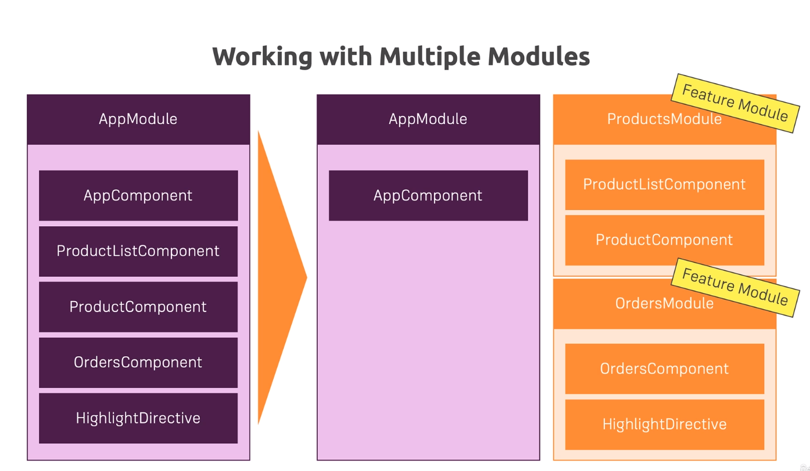

# Angular

- What is Angular?

    Angular is a Javascript Framework which allows you to create reactive **Single-Page-Applications(SPAs)**.

### Key points to learn

| No. | Topic |
|-----|-------|
|1|  [The Basics](#how-angular-project-starts)|
|2|  [Typescript](#typescript)|
|3|  [Bootstrap](#adding-bootstrap)|
|4|  [Component](#component)|
|5|  [Data Binding](#data-binding)|
|6|  [Directives](#directives)|
|7|  [Lifecycle Hooks](#lifecycle-hooks)|
|8|  [Services](#services)|
|9|  [Routing](#routing)|
|10| [Observables](#observables)|
|11| [Forms](#forms)|
|12| [Pipes](#pipes)|
|13| [HTTP](#http)|
|14| [Authentication](#authentication)|
|15| [Dynamic Components](#dynamic-components)|
|16| [Modules & Optimizations](#modules--optimizations)|
|17| [Deployment](#deployment)|
|18| [NgRx](#ngrx)|
|19| [Animations](#animations)|
|19| [Service Workers](#service-workers)|
|19| [Testing](#testing)|
|20| [Project](#project)|

#### How Angular Project Starts
  
  - First the CLI loads the **main.ts** file when running the command `ng serve`
  - AppModule [./app/app.module] is passed as a parameter in the main.ts file under bootstrapModule function.
  - Then it goes to the app.module.ts file where AppComponent is passed 
  `bootstrap: [AppComponent]` as argument to the `NgModule` decorator.
  - It means AppComponent should be known to Angular when it analyse the project.

  **[⬆ Back to Top](#key-points-to-learn)**

#### Typescript

  - Typescript is a superset of javascript
  - More features than vanilla JS (e.g Types, Classes, Interfaces, etc)
  - Typescript compiled to Javascript and run in browser

  **[⬆ Back to Top](#key-points-to-learn)**

#### Adding Bootstrap

  > ng add @ng-bootstrap/ng-bootstrap

  alternate

  > npm install bootstrap jquery

  ```json > angular.json
    "styles": [
      "node_modules/bootstrap/dist/css/bootstrap.min.css",
      "src/styles.css"
    ],
    "scripts": [
      "node_modules/jquery/dist/jquery.min.js",
      "node_modules/bootstrap/dist/js/bootstrap.min.js"
    ]
  ```

  **[⬆ Back to Top](#key-points-to-learn)**

#### Component

  - Components are the key feature of Angular
  - When creating an application we need different blocks like header, users, sidebar etc.
  - Each component has its own template, style and logic.
  - So that we can easily split our app into various piece of components.
  - To create a component we need to run `ng generate component <component-name>` or in short `ng g c <component-name> --skip-tests=true`
  - CLI will declare the newly generated component into the module file declarations array to let angular know this component exists.
  - templateUrl for refer external html file, we can use template for inline html.
  ex : `template: '<h1>Hello World</h1>'`
  - styleUrls for refer external style sheet it takes an array of different style urls. We can use inline style using styles array.
  ex : `styles: [ h3 { color : dodgerblue } ]`

  **[⬆ Back to Top](#key-points-to-learn)**

#### Data Binding

  - Communication between view (HTML) and logic (TS).
  - String Interpolation (`{{ data }}`)
  - Property Binding (`[propery] = "data"`)
  - Event Binding (`(event) = "expression"`)
  - Two-Way-Binding (`[(ngModel)] = "data"`)

  **[⬆ Back to Top](#key-points-to-learn)**
  
#### Directives

  - Directives are the Instructions in the DOM
    1. Structural Directive
    2. Attribute Directives

  - *ngIf is a **Structural Directive** i.e it adds or removes elemnts on the DOM so it has a * mark in it.

    ```js
    *ngIf="condition; else elseBlock"
    ```

    ```html
    <p *ngFor="let data of arrayList">{{data}}</p>
    ```

  - For the else block we need to declare a local reference 

    ```html 
    <ng-template #elseBlock>...</ng-template>
    ```

  - **Attribute Directives** don't add or remove elements. They only change the element.
    ```js
    [ngStyle]="{backgroundColor: getColor()}"
    [ngClass]="{success: status === 'online'}"
    ```

  - Access the Index in *ngFor
    ```html
    <p *ngFor="let data of arrayList; let i = index">{{data}}</p>
    ```

  - Custome Directive

    `@Directive` decorator is used for custome directive.
    ```bash
    ng generate directive highlight
    ```
    ```ts
    import { Directive, ElementRef, OnInit, Renderer2 } from '@angular/core';

    @Directive({
      selector: '[appHighlight]',
    })
    
    ```
    Refer `HighlightDirective`

  **[⬆ Back to Top](#key-points-to-learn)**

#### Lifecycle Hooks
 
  | Hooks  | Description  |
  |---|---|
  | `ngOnChanges`  | Called after a bound input property changes  |
  |  `ngOnInit` |  Called once the component is initialized |
  | `ngDoCheck`  | Called during every change detection run  |
  |  `ngAfterContentInit` |  Called every time the projected content has been checked |
  | `ngAfterViewInit`  | Called after the component's view (and child views) has been initialized  |
  | `ngAfterViewChecked`  | Called every time the view (and child views) have been checked  |
  | `ngOnDestroy` | Called once the component is about to be destroyed |

  **[⬆ Back to Top](#key-points-to-learn)**

#### Services

  - Service acts as central repository or central business unit.
  - No need to instanciate the class, it will auto instanciate by angular internally this process is called **Dependency Injection**.

    ```ts
    service = new Service();  // instanciate service
    constructor(private loggerService: LoggerService) {}  // Dependency Injection
    ```

  - Cross component communication ( declare 1 event in service which can be listen in 1 component and trigger in another component ).

    ```ts
    // declare the emitter in service instead of declaring in app component
    statusUpdated = new EventEmitter<string>();   

    // emitting status from account component
    this.accountService.statusUpdated.emit(status);

    // listen from another component
    constructor(private accountService: AccountService) {
      this.accountService.statusUpdated.subscribe(
        (status: string) => alert('New Status : ' + status);
      )
    }

    // if we done this without using services, have to set emitter then bind property send value listen event alot of things to do, so use service to communicate ... 
    ```
  
  **[⬆ Back to Top](#key-points-to-learn)**

#### Routing

  - If selected routing option when creating project then open `app-routing.module.ts`

  - `<router-outlet></router-outlet>` this is the placeholder for show the data in component.

  - Difference between `<a href='/user'>User</a>` and `<a routerLink='/user'>User</a>` is `routerLink` prevents the default behaviour of anchor tag that tends to reload the page.

  - `<a routerLink='/user'>User</a>` - we should always use '/user' which is an absolute path, if we use 'user' instead '/user' it will become a relative path which will cause error i.e \
  absolute path = `localhost:4200/user` \
  relative path = `localhost:4200/home/user`
  
  - styling active router 
    - `routerLinkActive='active'` this will add the `active` class to the active route.

  - to prevent the default path active all the time we should use 
    - `[routerLinkActiveOptions] = '{ exact : true }'`

  - route through program 
    ```ts
      onLoadServers(){
        this.router.navigate(['/servers']);
      }
    ```

  - fetching route parameters
    ```ts
      // Inject ActivatedRoute
      constructor(private route: ActivatedRoute){}    

      ngOnInit(){
        this.userId = this.route.snapshot.params['id'];

        // fetching route parameters reactively
        // the requirement is we want to load data in the params from the same page it already loaded, so that route snapshot will not detect the changes. 
        // so we need to use subscribe() of params which is an observable.

        this.paramsSubscription = this.route.params().subscribe(
          (params: Params) => this.userId = params['id'];
        )
      }

      // we need to unsubscribe the above observable by using Subscription

      import { Subscription } from 'rxjs/Subscription';
      paramsSubscription: Subscription;

      ngOnDestroy(){
        this.paramsSubscription.unsubscribe();
      }
    ```

  - passing query params and fragments

    - query params ex : `localhost:4200/user/10?mode=edit#focus`
    - pass query params to the route in html
    ```html
      <a 
        [routerLink]="[ '/user', 10 ]"
        [queryParams]="{ mode : 'edit' }"
        fragment="focus">
        {{ user.name }}
      </a>
    ```

    - pass query params to the route through program
    ```ts
      onLoadServer(id: number){
        this.router.navigate(
          [ '/user', id ], 
          { 
            queryParams : { 
              mode : 'edit'
            }
          },
          fragment : 'focus'
        );
      }
    ```

  - nested routing

    - all the child routes of a main route are called nested routes
    ```ts
      const appRoute: Routes = [
        { path: '', component: HomeComponent },
        { path: 'users', component: UsersComponent },
        { path: 'users/:id', component: UserComponent }
      ]

      // in the above code there are 2 user routes the second 1 is child route of first one.

      const appRoute: Routes = [
        { path: '', component: HomeComponent },
        { path: 'users', component: UsersComponent , 
          children: [
            { path: ':id', component: UserComponent }
          ]
        }
      ]
    ```
      - need to add `<router-outlet></router-outlet>` to the UsersComponent as it is the parent component else the children component will try to override the main outlet and cause error.

  - handling query params

    - to preserve the existing query params we will use
    ```ts
      onLoadServers(){
        this.router.navigate(['/servers'], { queryParamsHandling : 'preserve' });
      }
    ```

  - Redirect and Wildcard Routes
    - when we need to redirect to another path
    ```ts
      const appRoute: Routes = [
        { path: 'users', component: UsersComponent },
        { path: 'wrong-url', redirectTo: '/not-found' },
      ]

      // it's not possible to list all wrong-urls so we should use wildcard route
      const appRoute: Routes = [
        { path: 'users', component: UsersComponent },
        { path: '**', redirectTo: '/not-found' },
      ]

      // Wildcard Routes should always be in the last route

      // if we need to redirect when nothing in the path i.e '' it will cause error, to fix this we need the following

      const appRoute: Routes = [
        { path: '', redirectTo: '/home', pathMatch: 'full' },
      ]
    ```

  - Route Guards
    - Prevent routes to be accesible from unauthorized source
    ```ts
      // auth-guard.service.ts
      import { 
        CanActivate, 
        ActivatedRouteSnapshot, 
        RouterStateSnapshot,
        Router 
      } from '@angular/router';

      import { Observable } from 'rxjs/Observable';

      export class AuthGuard implements CanActivate {
        constructor(private authService: AuthService, private router: Router){}

        CanActivate(route: ActivatedRouteSnapshot, state: RouterStateSnapshot): Observable<boolean> | Promise<boolean> | boolean {
          return this.authService.isAuthenticated().then(
            (authenticated : boolean) => {
              if (authenticated)
                return true;
              else
                this.router.navigate(['/']);
            }
          )
        }
      }

      // app-routing.module.ts
      const appRoute: Routes = [
        { path: 'users', canActivate: [ AuthGuard ], component: UsersComponent },
        { path: '**', redirectTo: '/not-found' },
      ]

      // CanActivateChild
      // CanDeactivate
    ```

    - Passing static data to a route
    ```ts
      const appRoute: Routes = [
        { path: 'users', canActivate: [ AuthGuard ], component: UsersComponent },
        { path: '**', component: ErrorComponent, data: { 'message':'Page Not Found' } },
      ]

      errorMessage: string;
      constructor(private route: ActivatedRoute){}

      ngOnInit(){
        this.route.data.subscribe(
          (data: Data) => {
            this.errorMessage = data['message'];
          }
        )
      }
    ```

    - Resolver - Runs before a route load to insure the data it depends is there.

      ```ts
        // recipes-resolver.service.ts
        resolve(
          route: ActivatedRouteSnapshot,
          state: RouterStateSnapshot
        ): Recipe[] | Observable<Recipe[]> | Promise<Recipe[]> {
          return this.dataStorageService.fetchRecipes();
        }
      ```

  - Location Strategies

    - We should use Hash mode in production server for routing, because production doesn't understand the single page routing. It will search for the file and folders for the route for example `/users` server will search for users folder and index.html file of it. So we need to configure our app by using Hash mode.

    ```ts
    // app-routing.module.ts
      @NgModule({
        imports: [RouterModule.forRoot(routes, { useHash: true })],
        exports: [RouterModule],
      })

    // this will convert the url with a # before the route
    "localhost:4200/#/user/10?mode=edit#focus"
    ``` 

  **[⬆ Back to Top](#key-points-to-learn)**

#### Observables

  - An Observables can be called as data source. 
  - Various data sources like User input events, Http Requests, Triggred in code etc.
  - The other end is the Observer which is our code. We can do Handle Data, Handle Error, Handle Completion.

  - Let's create our own observable

    ```ts
      import { interval, Subscription, Observable } from 'rxjs';

      private firstObsSubscription: Subscription;

      ngOnInit(){
        // let's use interval observable provided by rxjs
        this.firstObsSubscription = interval(1000).subscribe(count => {
          console.log(count);
        })

        // create own observable
        const customIntervalObservable = Observable.create(observer => {
          let count = 0;
          setInterval(()=>{
            observer.next(count);
            if(count > 10){
              observer.error(new Error('Count is greater than 10'));    // Handle Error
            }
            if(count === 10){
              observer.complete();    // Handle Completion
            }

            count++;
          }, 1000)
        });

        this.firstObsSubscription = customIntervalObservable.subscribe(data => {
          console.log(data);    // Handle Data
        }, error => {
          console.log(error);
        }, () => {
          console.log('Observable Completed');
        })
      }

      // when we don't need the data from an observable we have to unsubscribe the subscription

      ngOnDestroy(): void {
        this.firstObsSubscription.unsubscribe();
      }
    ```

  - Observable Operators

    - Sometimes we need to modify the data we got from observables, there operators will be usefull because operators comes in between observables and subscription data.

    ```ts
      import { map } from 'rxjs/operators';

      // we need to modify the data exclude 0 and other data to include ( Round : + data )

      customIntervalObservable.pipe(
        filter((data : number) => {
          return data > 0;
        }),
        map((data : number) => {
          return 'Round : ' + data;
        })
      ).subscribe(data => console.log(data));

    ```

  - Subjects

    - Acts similar as event emitter but have more features than it.
    ```ts
      import { Subject } from 'rxjs';

      // emit data from user component to app component using Subject
      
      // service
      export class UserService{
        activatedEmitter = new Subject<boolean>();
      }

      // user component
      onActivate(){
        this.userService.activatedEmitter.next(true);
      }

      // app component
      ngOnInit(){
        this.activatedSub = this.userService.activatedEmitter
        .subscribe( didActivated => this.userActivated = didActivated )
      }

      ngOnDestroy(){
        this.activatedSub.unsubscribe();
      }
    ```
  
  **[⬆ Back to Top](#key-points-to-learn)**

#### Forms

  1. `Template-Driven` - Angular infers the Form Object from the DOM
  2. `Reactive` - Created programmatically and synchronized with the DOM

  - Template-Driven
    ```html
      <!-- angular will generate the javascript elements from this <form> tag and the ngModel will refer this <input> tag as a control -->
      <form (ngSubmit)="onSubmit()" #form="ngForm">
        <div ngModelGroup="userData" #userdata="ngModelGroup">
          <input type="text" name="username" ngModel /> 
          <button type="submit" [disabled]="!form.valid">Submit</button>
        </div>
      </form>

      <!-- ngModelGroup="userData" => group the form data -->
      <!-- #userdata="ngModelGroup" => get access to javascript object -->
    ```
    
    ```ts
      // app.module.ts

      import { FormsModule } from '@angular/forms';

      @NgModule({
        ...
        imports: [FormsModule]
        ...
      })

      // app.component.ts

      import { NgForm } from '@angular/forms';

      @ViewChild('form') signupForm: NgForm;

      /*
      onSubmit(form: NgForm){
        console.log(form);
      }
      */

      onSubmit(){
        // access the form data
        console.log(this.signupForm.value.userData);

        // reset form
        this.signupForm.reset();
      }
    ```

  - Reactive

    ```ts
      // app.module.ts

      import { ReactiveFormsModule } from '@angular/forms';

      @NgModule({
        ...
        imports: [ReactiveFormsModule]
        ...
      })

      // app.component.ts

      import { FormGroup, FormControl, FormArray, Validators } from '@angular/forms';

      signupForm: FormGroup;
      forbiddenUserNames: any[] = ['Chris', 'Anna'];

      ngOnInit(){
        this.signupForm = new FormGroup({
          'username': new FormControl(null, [ Validators.required, this.forbiddenNames.bind(this) ]),
          'email': new FormControl(null, [ Validators.required, Validators.email ], this.forbiddenEmails ),
          'gender': new FormControl('male'),
          'hobbies': new FormArray([])
        });
      }

      onSubmit(){
        console.log(this.signupForm);
      }

      // custom validator
      forbiddenNames(control: FormControl): {[s: string]: boolean}{
        if(this.forbiddenUserNames.indexOf(control.value) !== -1){
          return { 'nameIsForbidden': true };
        }
        return null;
      }

      // custom async validator
      forbiddenEmails(control: FormControl): Promise<any> | Observable<any> {
        const promise = new Promise<any>((resolve, reject) => {
          setTimeout(() => {
            if(control.value === 'test@test.com'){
              resolve({ 'emailIsForbidden': true });
            } else {
              resolve(null);
            }
          }, 2000);
        });
        return promise;
      }
    ```

    ```html
      <form (ngSubmit)="onSubmit()" [formGroup]="signupForm">
          <input type="text" name="username" formControlName="username" /> 
          <span *ngIf="signupForm.get('username').invalid && signupForm.get('username').touched">
            Please enter a valid username
          </span>
          <button type="submit">Submit</button>
      </form>
    ```
  
  **[⬆ Back to Top](#key-points-to-learn)**

#### Pipes

  - Pipes helps to transforms output in the template.
    ```html
      <p>{{ username | uppercase }}</p>
    ```

  - Parameterizing Pipes
    ```html
      <p>{{ startdate | date:'fullDate' }}</p>
    ```

  - Chaining Pipes
    ```html
      <p>{{ startdate | date:'fullDate' | uppercase }}</p>
      <!-- pipe order is very important - date pipe will apply first then uppercase -->
    ```

  - Custom Pipes
    ```bash
      ng generate pipe shared/shorten
    ```

    ```ts
      import { Pipe, PipeTransform } from '@angular/core';

      @Pipe({
        name: 'shorten',
      })
      export class ShortenPipe implements PipeTransform {
        transform(value: any, limit: number): any {
          if (value.length >= limit) return value.substr(0, limit) + ' ...';
          return value;
        }
      }
    ```

    ```html
      <p>{{ recipe.description | shorten:10 }}</p>
    ```
  
  - Async Pipe

    ```html
      <p>{{ getStatus() | async }}</p>
    ```
  
  **[⬆ Back to Top](#key-points-to-learn)**

#### HTTP

  - Communicate with backend and web apis

  - Anatomy of a http request
    - URL (API Endpoint) = /post/1
    - Http Verb = POST,GET,PUT etc
    - Headers (metadata) = {"Content-Type": "application/json"}
    - Body = {title:"New Post"}


  - Post Request to [Firebase](https://console.firebase.google.com/)
  
    ```ts
      // app.module.ts
      import { HttpClientModule } from '@angular/common/http';

      ...
      imports: [HttpClientModule]
      ...

      // posts.service.ts
      import { HttpClient } from "@angular/common/http";

      constructor(private http: HttpClient) {}

      createPosts(title: string, content: string) {
        const postData: Post = { title, content };

        return this.http.post<{ name: string }>(this.url, postData);
      }

      // app.component.ts
      import { PostsService } from "./posts.service";

      constructor(private postService: PostsService) {}

      onCreatePost(postData: Post) {
        this.postService
          .createPosts(postData.title, postData.content)
          .subscribe(() => {
            this.onFetchPosts();
          });
      }
    ```

  - Error Handling

    ```ts
      onClearPosts() {
        this.postService.deletePosts().subscribe(() => {
          this.loadedPosts = [];
        }, error => {
          this.error = error.message;
        });
      }
    ```

  - Headers

    ```ts
      createPosts(title: string, content: string) {
        const postData: Post = { title, content };
        return this.http.post<{ name: string }>(this.url, postData, {
          headers: new HttpHeaders({ "Custom-Auth": "100190910" })
        });
      }
    ```

  - Params

    ```ts
      let searchParams = new HttpParams();
      searchParams = searchParams.append('print','pretty');
      searchParams = searchParams.append('limit','10');

      createPosts(title: string, content: string) {
        const postData: Post = { title, content };
        return this.http.post<{ name: string }>(this.url, postData, {
          // single param
          // params: new HttpParams().set('print','pretty')
          // url/posts.json?print=pretty

          // multiple params
          params: searchParams 
          // url/posts.json?print=pretty&limit=10
        });
      }
    ```

  - Observe

    ```ts
      createPosts(title: string, content: string) {
        const postData: Post = { title, content };
        return this.http.post<{ name: string }>(this.url, postData, {
          observe: 'response'   // access to the whole response with proper format
        });
      }

      deletePosts() {
        return this.http.delete(this.url,{
          observe: 'events'   // access to the event types
        })
        .pipe(
          tap(event => {
          // tap is a rxjs operator used for execute some code without affecting the subscribe function etc.
          
          if (event.type === HttpEventType.Sent){
            console.log('Response Sent');
          }
        }));
      }
    ```

  - Change Response Type

    ```ts
      createPosts(title: string, content: string) {
        const postData: Post = { title, content };
        return this.http.post<{ name: string }>(this.url, postData, {
          responseType: 'json'    // text, xml, blob etc
        });
      }
    ```

  - Interceptors

    - Used for intercept the http requests. If need to perform some changes before http call.

    - Request Interceptor

      ```ts
        // auth.interceptor.service.ts
        import { HttpEvent, HttpHandler, HttpInterceptor, HttpRequest } from "@angular/common/http";
        import { Injectable } from "@angular/core";
        import { Observable } from "rxjs";

        @Injectable({
          providedIn: "root",
        })
        export class AuthInterceptorService implements HttpInterceptor {
          intercept(req: HttpRequest<any>, next: HttpHandler): Observable<HttpEvent<any>> {
            const modifiedRequest = req.clone({
              headers: req.headers.append("Authorization", "NEuRlvL013A789"),
            });
            console.log("Request Intercept");
            return next.handle(modifiedRequest);
          }
        }

        // app.module.ts
        import { HttpClientModule, HTTP_INTERCEPTORS } from "@angular/common/http";
        import { AuthInterceptorService } from "./auth-interceptor.service";

        ...
        providers: [
          {
            provide: HTTP_INTERCEPTORS,
            useClass: AuthInterceptorService,
            multi: true,
          },
        ],
        ...
      ```

    - Response Interceptor

      ```ts
        ...

        return next.handle(modifiedRequest).pipe(
          // anything we can do with the response like map, filter etc
          tap(event => {
            console.log(event);
            if(event.type === HttpEventType.Response){
              console.log("Response Body", event.body);
            }
          })
        );

        ...
      ```

    - Multiple Interceptor

      - when adding multiple interceptors make sure they in proper order in app.mudule.ts file.

        ```ts
          ...
          providers: [
            {
              provide: HTTP_INTERCEPTORS,
              useClass: AuthInterceptorService,
              multi: true,
            },
            {
              provide: HTTP_INTERCEPTORS,
              useClass: LoggingInterceptorService,
              multi: true,
            },
          ],
        ...

        // here first AuthInterceptorService will work after that LoggingInterceptorService will work
        ```

  **[⬆ Back to Top](#key-points-to-learn)**

#### Authentication

  - Signup and Login with auth key
  - How authentication works

    

  - Signup and Login by using firebase authentication

    ```json
    signup = {
      "kind": "identitytoolkit#SignupNewUserResponse",
      "idToken": "eyJhbGciOiJSUzI1NiIsImtpZCI6IjVkMzQwZGRiYzNjNWJhY2M0Y2VlMWZiOWQxNmU5ODM3ZWM2MTYzZWIiLCJ0eXAiOiJKV1QifQ...",
      "email": "user1@gmail.com",
      "refreshToken": "AOEOulajhbbMsViDBLVapXIScAt18qAnIB..",
      "expiresIn": "3600",
      "localId": "3Ea6cZdhQjfPDhHkIXnQpvIDjUn2"
    }

    login = {
      "kind": "identitytoolkit#VerifyPasswordResponse",
      "localId": "3Ea6cZdhQjfPDhHkIXnQpvIDjUn2",
      "email": "user1@gmail.com",
      "displayName": "",
      "idToken": "eyJhbGciOiJSUzI1NiIsImtpZCI6IjNmNjcyNDYxOTk4YjJiMzMyYWQ4MTY0ZTFiM2JlN2VkYTY4NDZiMzciLCJ0eXAiOiJKV1QifQ...",
      "registered": true,
      "refreshToken": "AOEOulYzQ0swKG11aNvXaYsOAVZk_..",
      "expiresIn": "3600"
    }
    ```

  - Add token using Interceptors

    ```ts
    export class AuthInterceptorService implements HttpInterceptor {
      constructor(private authService: AuthService) {}

      intercept(
        req: HttpRequest<any>,
        next: HttpHandler
      ): Observable<HttpEvent<any>> {
        return this.authService.user.pipe(
          take(1),
          exhaustMap((user) => {
            if (!user) return next.handle(req);

            const modifiedRequest = req.clone({
              params: new HttpParams().set('auth', user.token),
            });
            return next.handle(modifiedRequest);
          })
        );
      }
    }
    ```

  **[⬆ Back to Top](#key-points-to-learn)**
  
#### Dynamic Components

  - Load components programmatically
    - *ngIf
    - Component Factory Resolver

      ```ts
        const alertComFactory = this.componentFactoryResolver.resolveComponentFactory(AlertComponent);
        const hostViewContainerRef = this.alertHost.viewContainerRef;
        
        hostViewContainerRef.clear();
        
        const componentRef = hostViewContainerRef.createComponent(alertComFactory);
        componentRef.instance.message = message;

        // app.module.ts - entryComponents required in angular v < 9
        ...
          entryComponents:[
            AlertComponent
          ]
        ...
      ```

  **[⬆ Back to Top](#key-points-to-learn)**

#### Modules & Optimizations

  - Angular analyzes NgModules to "understand" your application and its features.
  
  - Angular modules define all building blocks your app uses: Components, Directives, Services etc.

  - An app requires at least one module (AppModule) but may be split into multiple modules.

    

  - Core Angular feature are included in Angular modules (e.g. FormsModule) to load them only when needed.

  - You can't use a feature/building block without including it in a module.

  - Shared Module

    - Commonly used features within different modules can be used as shared module.

    - We just need to import the shared module to use the features.

  - Core Modules

    - If we have multiple services in app module providers array, then we can create a core module and put all providers there and just import the core module to app module.

  - Lazy Loading

    - Load the module when it required.
    - Only load the app module and don't load another module at once so that app will faster.
    
  - Preloading Modules

    - When we lazy load modules it will download the module when it required which will cause little delay in app load to prevent this we can use preloading.

    ```ts
    ...
      imports: [
        RouterModule.forRoot(routes, { preloadingStrategy: PreloadAllModules }),
      ]
    ...
    ```

  **[⬆ Back to Top](#key-points-to-learn)**
  
#### Deployment

  - Use & check environment variables
      ```ts
      // environments/environment.ts
      export const environment = {
        production: false
      };
      ```
  - Polish & test code
  - Generate dist files by using command `ng build`

  - `firebase login`
  - `firebase init`
  - Choose the project name and other options
  - `firebase deploy`
  - Hosting URL: [Recipe Book](https://angular-86654.web.app)

  **[⬆ Back to Top](#key-points-to-learn)**

#### NgRx

  - In a typical angular application we need to store varius data like user login details, product details etc but when application refresh data will be gone to prevent that we need a database. To manage the data within the application before sending to database and after fetching from database is called **State Management**.

  

  - In Angular we have RxJS for state management but there is some issues.
    - State can be updated anywhare
    - State is possible mutable
    - Handling side effects (e.g. Http calls) is unclear
    - No specific pattern is enforced
  
  -  Redux to the Rescue
    - One central Store (Application State)
    - Services, Components receive state from the central state
  
  

  - NgRx is a Angulars implementation of Redux

  

  - Install NgRX
    - `ng add @ngrx/store@latest`
  
    - NgRx Effects
      - `ng add @ngrx/effects`

    - NgRx Store Devtools
      - `ng add @ngrx/store-devtools@latest`

    - NgRx Router
      - `ng add @ngrx/router-store`

  **[⬆ Back to Top](#key-points-to-learn)**  
  

#### Animations

  - `npm install --save @angular/animations`
  - Add the BrowserAnimationsModule  to your imports[]  array in AppModule
  - This Module needs to be imported from `@angular/platform-browser/animations`  => `import { BrowserAnimationsModule } from '@angular/platform-browser/animations`  (in the AppModule!)
  - You then import trigger , state , style  etc from `@angular/animations`  instead of `@angular/core` ( compering with angular 4 )

  ```ts
  @component({
    animations:[
      // box animation
      trigger('divAnimate', [
        state('normal', style({
          backgroundColor:'gray',
          transform: 'translateX(0)',
        })),
        state('highlighted', style({
          backgroundColor:'blue',
          transform: 'translateX(100px)'
        })),
        //transition('normal => highlighted', animate(1000)),
        //transition('highlighted => normal', animate(1000))

        transition('normal <=> highlighted', animate(1000))
        // from any state to shrunken use * (wildcard)
        transition('shrunken <=> *', [
          style({
            backgroundColor: 'orange'
          }),
          animate(1000, style({
            borderRadius: '50px'
          })),
          animate(500)
        ])  
      ]),

      // list animation
      trigger('list',[
        state('in', style({
          opacity: 1,
          transform: 'translateX(0)'
        })),
        transition('void => *', [
          style({
            opacity: 0,
            transform: 'translateX(-100px)'
          }),
          animate(300)
        ]),
        transition('* => void', [
          animate(300, style({
            opacity: 0,
            transform: 'translateX(100px)'
          }))
        ])
      ])

      // keyframes
      trigger('list',[
        state('in', style({
          opacity: 1,
          transform: 'translateX(0)'
        })),
        transition('void => *', [
          animate(1000, keyframes([
            style({
              transform: 'translateX(-100px)',
              opacity:0,
              offset:0
            }),
            style({
              transform: 'translateX(-50px)',
              opacity:0.5,
              offset:0.3
            }),
            style({
              transform: 'translateX(-20px)',
              opacity:1,
              offset:0.8
            }),
            style({
              transform: 'translateX(0px)',
              opacity:1,
              offset:1
            }),
          ]))
        ]),
      ])

      // group
      transition('* => void', [
        group([
          animate(300, style({
            color: 'red'
          })),
          animate(300, style({
            opacity: 0,
            transform: 'translateX(100px)'
          }))
        ])
      ])
    ]
  })

  state = "normal";
  ```

  ```html
  <div [@divAnimate]="state" class="animDiv"></div>

  <!-- animation callbacks -->
  <div class="animDiv" 
    [@divAnimate] = "state"
    (@divAnimate.start) = "animationStarted($event)"
    (@divAnimate.done) = "animationEnded($event)"
    >
  </div>
  ```

  **[⬆ Back to Top](#key-points-to-learn)**

#### Service Workers
  - Service worker manages all pages (js, css, font) and cached for available offline.
  - `ng add @angular/pwa`
  
  ```json
  // ngsw-config.json
  "dataGroups": [
    {
      "name": "posts",
      "urls": [
        "https://jsonplaceholder.typicode.com/posts"
      ],
      "cacheConfig": [
        "maxSize": 5,
        "maxAge": "12h" //1d, 1h, 50m etc
        "timeout": "10s",
        "strategy": "freshness" // performance
      ]
    }
  ]
  ```

  **[⬆ Back to Top](#key-points-to-learn)**

#### Testing

  - Test file => `.spec.ts`
  
  ```ts
  decribe('Component: User', () => {
    beforeEach(() => {
      TestBed.configureTestingModule({
        declarations: [ UserComponent ]
      })
    })

    it('should create the app', () => {
      let fixture = TextBed.createComponent(UserComponent);
      let app = fixture.debugElement.componentInstance;
      expect(app).toBeTruthy();
    });

    it('should use the user name from the service', () => {
      let fixture = TextBed.createComponent(UserComponent);
      let app = fixture.debugElement.componentInstance;
      let userService = fixture.debugElement.injector.get(UserService);
      fixture.detectChanges();
      expect(userService.user.name).toEqual(app.user.name);
    })
  });
  ```

  - `ng test`

  **[⬆ Back to Top](#key-points-to-learn)**


---

### Project
  

**[⬆ Back to Top](#key-points-to-learn)**

<!-- 
<style>
  table:nth-of-type(1) {
    display:table !important;
    width:100% !important;
  }
  table:nth-of-type(1) th:nth-of-type(2) {
    width:95% !important;
  }
</style> 
-->